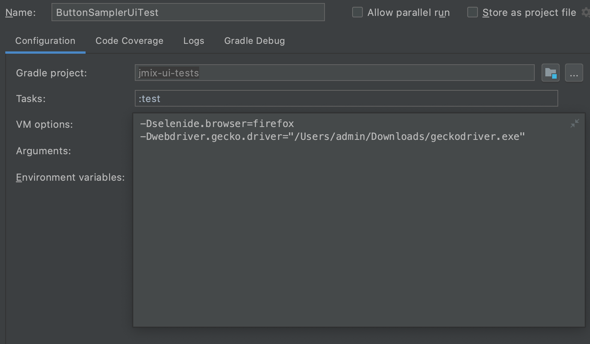

jmix-masquerade
==========

Jmix UI testing library. 

<a href="http://www.apache.org/licenses/LICENSE-2.0"></a>

# Overview

With the help of this library, you can create end-to-end tests for your Jmix application in Java or Kotlin and run them manually or in your CI environment.

Masquerade allows you to separate test scenarios from the complexity of the UI elements under test. Firstly, you describe the UI screen content declaratively in a simple Java or Kotlin class with annotated fields, and then you use this class in test scenarios as a substitute of the real UI elements. 
 
Masquerade is based on Selenide and Selenium.

You can find examples of using the library in the following projects:
- https://github.com/jmix-projects/jmix-sample-ui-test
- https://github.com/Haulmont/jmix-ui-tests

# Installation

Add the following dependencies to your `build.gradle` file:

```groovy
implementation('org.jsoup:jsoup') {
    version {
        strictly '1.11.2'
    }
}
testImplementation 'com.codeborne:selenide:5.20.1'
testImplementation 'io.jmix.masquerade:jmix-masquerade:<latest version>'
```

Get the latest version from the [list of releases](https://github.com/Haulmont/jmix-masquerade/releases).


# Creating tests

Let's consider creating UI test on an example.

In the `src/test/java` folder, create a new package in `com.company.demo` and name it `screen`. 
Create a new Java class in this package and name it `LoginScreen`. This class 
should extend `Composite<T>` where `T` is the name of your 
class under test. This class will be used as a helper class, usually it declares UI 
components of an application screen / fragment / panel that is shown in a web page. 
Also, all test methods can be declared here.
 
All class attributes should be marked with the ```@Wire``` annotation. 
This annotation has optional `path` element which allows userService to define 
the path to the component using the `j-test-id` parameter. If the component does 
not have the `j-test-id` parameter, you can use the ```@FindBy``` annotation 
instead. This annotation has a list of optional parameters, like `name`, 
`className`, `id` and so on, which helps to identify the component.

The type of the attribute in the class corresponds to the type of the screen 
component. If the component has a type which is not defined in the library, use 
the `Untyped` type. 

The name of the attribute corresponds to the `j-test-id` attribute of a DOM 
element that corresponds to the UI component. 

```java
package com.company.demo.screen;

import io.jmix.masquerade.Wire;
import io.jmix.masquerade.base.Composite;
import io.jmix.masquerade.component.*;
import org.openqa.selenium.support.FindBy;


public class LoginScreen extends Composite<LoginScreen> {

    @Wire
    private TextField usernameField;

    @Wire
    private PasswordField passwordField;

    @Wire(path = {"loginForm", "loginButton"})
    private Button loginButton;

    @Wire
    private ComboBox localesField;

    @Wire
    private Label welcomeLabel;

    @FindBy(className = "jmix-login-caption")
    private Label welcomeLabelTest;

    public TextField getUsernameField() {
        return usernameField;
    }

    public PasswordField getPasswordField() {
        return passwordField;
    }

    public Button getLoginButton() {
        return loginButton;
    }

    public ComboBox getLocalesField() {
        return localesField;
    }

    public Label getWelcomeLabel() {
        return welcomeLabel;
    }

    public Label getWelcomeLabelTest() {
        return welcomeLabelTest;
    }
}
``` 

Create a Java class in the `com.company.demo` package in the `src/test/java` folder. Name it `LoginUiTest`. 

Create a new method and add ```@Test``` JUnit 5 annotation to it. The ```@Test``` 
annotation tells JUnit 5 that the public void method can be run as a test case. 
 
You can use all JUnit 5 annotations to improve the tests. Also it is possible to 
use a set of assertion methods provided by JUnit 5.
 
```java
package com.company.demo;

import com.company.demo.screen.LoginScreen;
import io.jmix.masquerade.component.Untyped;
import org.junit.jupiter.api.Test;

import static com.codeborne.selenide.Selenide.closeWindow;
import static com.codeborne.selenide.Selenide.open;
import static io.jmix.masquerade.Components.wire;
import static io.jmix.masquerade.Conditions.*;
import static io.jmix.masquerade.Selectors.$j;
import static org.junit.jupiter.api.Assertions.assertNotNull;

public class LoginUiTest {

    @Test
    public void login() {
        // open URL of an application
        open("http://localhost:8080");

        // obtain UI object
        LoginScreen loginScreen = $j(LoginScreen.class);

        assertNotNull(loginScreen.getUsernameField());
        assertNotNull(loginScreen.getPasswordField());

        // fluent asserts
        loginScreen.getUsernameField()
                .shouldBe(EDITABLE)
                .shouldBe(ENABLED);

        // setting values
        loginScreen.getUsernameField().setValue("admin");
        loginScreen.getPasswordField().setValue("admin");

        // fluent asserts
        loginScreen.getWelcomeLabelTest()
                .shouldBe(VISIBLE);

        // fluent asserts
        loginScreen.getLoginButton()
                .shouldBe(VISIBLE)
                .shouldBe(ENABLED)
                .shouldHave(caption("Submit"));

        Untyped loginForm = wire(Untyped.class, "loginForm");
        loginForm.shouldBe(VISIBLE);

        loginScreen.getLoginButton().click();

        // close the browser tab
        closeWindow();
    }
}
``` 

The `open()` method is a standard Selenide method. It opens a browser window 
with the given URL. The second line creates an instance of the masquerade 
Component and binds it to the UI component (LoginScreen) on the screen including 
all the annotated fields inside of the LoginScreen class. After that, you can 
access the screen components as class attributes. You can check the attributes 
visibility, get captions, set values, click the buttons and so on.

# Running tests

To run the test, first of all, you need to set ```jmix.ui.testMode``` property to 
true in the `application.properties` file in your Jmix application. After that you 
should start the application using Studio or Gradle tasks. To start application 
with Gradle, run the following tasks in the terminal:

    gradle bootRun

## Webdriver containers

[Testcontainers](https://www.testcontainers.org/modules/webdriver_containers/) can 
be used to automatically instantiate and manage containers that include web browsers, 
such as Chrome or Firefox. No need to have specific web browsers, or even a desktop 
environment, installed on test servers. The only dependency is a working Docker 
installation and your Java JUnit test suite.
Creation of browser containers is fast, so it's actually quite feasible to have a 
totally fresh browser instance for every test.

First of all, you need to add the testcontainer dependencies to the `build.gradle` file:
```groovy
// testcontainers
testImplementation 'org.testcontainers:selenium:1.15.2'
testImplementation 'org.testcontainers:junit-jupiter:1.15.2'
```

Secondly, you can create a JUnit 5 extension to run and configure a container with a browser.
```java
package com.company.demo.extension;

import com.codeborne.selenide.Selenide;
import com.codeborne.selenide.WebDriverRunner;
import org.junit.jupiter.api.extension.AfterEachCallback;
import org.junit.jupiter.api.extension.BeforeEachCallback;
import org.junit.jupiter.api.extension.ExtensionContext;
import org.openqa.selenium.chrome.ChromeOptions;
import org.testcontainers.containers.BrowserWebDriverContainer;

public class ChromeExtension implements BeforeEachCallback, AfterEachCallback {

    private BrowserWebDriverContainer browser;

    @Override
    public void beforeEach(ExtensionContext context) throws Exception {
        browser = new BrowserWebDriverContainer()
                .withCapabilities(new ChromeOptions());
        browser.start();
        WebDriverRunner.setWebDriver(browser.getWebDriver());
    }

    @Override
    public void afterEach(ExtensionContext context) throws Exception {
        WebDriverRunner.getWebDriver().manage().deleteAllCookies();
        Selenide.closeWebDriver();
        browser.stop();
    }
}
```

Thirdly, declare the JUnit 5 extension in your test using `@ExtendWith` annotation
```java
@ExtendWith(ChromeExtension)
public class LoginUiTest {

    @Test
    public void login() {
        open('http://localhost:8080')

        LoginScreen loginScreen = $j(LoginScreen.class);
        ...
    }
}
```

## Locally installed browser drivers

Please note that you need to download one of the latest versions of the web 
driver depending on the browser you want to use to testing.
For Chrome browser this is [chromedriver](http://chromedriver.chromium.org/downloads), 
for Firefox this is [geckodriver](https://github.com/mozilla/geckodriver/releases).

### Chrome browser

If you run your tests in Chrome browser, you need to edit standard
test configuration for the test project in IntelliJ. To do so, click the 
*Select Run/Debug Configuration* button and select *Edit Configurations*  in the 
drop-down list. In the VM options field, add the following:

```
-Dselenide.browser=chrome 
-Dwebdriver.chrome.driver=<your_path>/chromedriver.exe 
```

where `<your_path>` is the path to the chrome driver on your computer.


After that select the simple test or the test class you want to run, right 
click on it and select *Debug* option.

To run the tests using Gradle, add the following task to the `build.gradle` file:
```groovy
test {
     systemProperty 'selenide.browser', System.getProperty('selenide.browser')
     systemProperty 'webdriver.chrome.driver', System.getProperty('webdriver.chrome.driver')
}
```
After that, run the following task in the terminal:
```
gradle test -Dselenide.browser=chrome -Dwebdriver.chrome.driver=<your_path>/chromedriver.exe
```
    
where `<your_path>` is the path to the chrome driver on your computer.

### Firefox browser

If you run your tests in Firefox browser, you need to edit standard
test configuration for the test project in IntelliJ. To do so, click the 
*Select Run/Debug Configuration* button and select *Edit Configurations*  in the 
drop-down list. In the VM options field, add the following:

```
-Dselenide.browser=firefox
-Dwebdriver.gecko.driver=<your_path>/geckodriver.exe 
```
where `<your_path>` is the path to the firefox driver on your computer.



After that select the simple test or the test class you want to run, right 
click on it and select *Debug* option.

To run the tests using Gradle, add the following task to the `build.gradle` file:
```groovy
test {
     systemProperty 'selenide.browser', System.getProperty('selenide.browser')
     systemProperty 'webdriver.gecko.driver', System.getProperty('webdriver.gecko.driver')
}
```
After that, run the following task in the terminal:
```
gradle test -Dselenide.browser=firefox -Dwebdriver.gecko.driver=<your_path>/geckodriver.exe
```
where `<your_path>` is the path to the firefox driver on your computer.

# Tips & Tricks

Here are some useful tips on how to work with the library.

## How to work with elements

The library has a special method  ```$j``` to define any element on the screen. 
This method has three implementations:

* The first implementation gets the element by its class:

    ```$j(Class<T> clazz)```
* The second implementation gets the element by its class and the path:

    ```$j(Class<T> clazz, String... path)```
* The third implementation gets the element by its class and _by_ selector:

    ```$j(Class<T> clazz, By by)```
    
For example, we can click the button on the screen: 

```java
import static io.jmix.masquerade.Components.$j;

$j(Button, 'logoutButton').click();
```

## How to check the state of an element

Selenide allows you to check some conditions.

To check if the element is enabled, visible or checked, use the `shouldBe` 
element. For example:

```java
loginButton
   .shouldBe(VISIBLE)
   .shouldBe(ENABLED);
```

To check if the element has some properties, use the `shouldHave` element. For example:

```java
welcomeLabel.shouldHave(Conditions.value('Welcome to Jmix application!'));
```    

## How to work with the Selenide elements
    
If the component does not have the `j-test-id` parameter, you can use the 
```@FindBy``` annotation. This annotation has a list of optional parameters, 
like `name`, `className`, `id` and so on, which helps to identify the component.

```java
@FindBy(className = "jmix-login-caption")
public Label welcomeLabelTest;
```    

Also, using this annotation, you can define `SelenideElement` type for the attribute 
instead of the types provides by masquerade. After that, you can use all test 
methods provided by Selenide. The name of the attribute can be any.

```java
import com.codeborne.selenide.SelenideElement;

@FindBy(className = "jmix-login-caption")
public SelenideElement welcomeLabelTest;
```   

Another way to define the `SelenideElement` type attribute is using the 
```@Wire``` annotation. You can write the `SelenideElement` type instead of 
masquerade types, but the name of the attribute should correspond to the 
`j-test-id` attribute of a DOM element that corresponds to the UI component.

```java
@Wire
public SelenideElement loginField;
```    

The third way to work with the Selenide elements is to use ```getDelegate()``` 
method. This method returns the `SelenideElement` type component. After that, you 
can use all test methods provided by Selenide.

```java
loginScreen.getDelegate().exists();
```    

## Useful tips for the Groovy tests

You can use any JVM language with the library including Groovy / Scala / Kotlin. 
There are some useful tips for those who use Groovy to write the tests. 

* .with() method.

Groovy closures have a delegate associated with them. The delegate can respond 
to method calls which happen inside of the closure. It enables you to use 
methods/properties within a `with {}` closure without having to repeat the 
object name each time.

```groovy
loginScreen.with {
    loginField.value = 'testUser'
    passwordField.value = '1'
    rememberMeCheckBox.checked = true

    commit()
}
```
* Ability to set the value of the element using "property access" syntax

In Groovy, getters and setters form what we call a "property", and offer a 
shortcut notation for accessing and setting such properties. So instead of the 
Java-way of calling getters / setters, you can use a field-like access notation: 

```groovy
loginField.value = 'testUser'
```

* def

```def``` means that the actual type of the value will be automatically inferred 
by the compiler. It eliminates the unnecessary boilerplate in variable 
declarations and makes your code shorter.

```groovy
def loginScreen = $j(LoginScreen)
```
